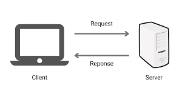

# **HTML Session Notes**
This document is for **STEAM4Girls IV**, has notes for **`HTML`** session of the web devlopment module 


## **The Server - Client Architecture (Model)**
We recognize 3 main terms here, which are:
- **Client:** The one (a person or an organisation) who is or will be using the service that a **server** provides.

- **Server:** is a remote computer that provides access to **data and services**.

- **HTTP (*Hypertext Transfer Protocol*):** a protocol for transmitting hypermedia documents, such as HTML. It was designed for communication between web browsers and web servers

    

### **How it works?**
Briefly, it goes like: 
- First, the client sends their request via a network-enabled device

- Then, the network server accepts and processes the user request

- Finally, the server delivers the reply to the client, in all cases, either something wrong happended or the request was a success


## **The General Structure of the Document**
```html

    <!DOCTYPE html>
    <html>
        <head>
            <!-- This is a comment, the browser will not display me on your screen :P -->
            <!-- You can also put some meta tags here -->
            <title>Your Website Document Here</title>
        </head>

        <body>
            <!-- This the body area, your content goes here, you make put whatever you want -->
        </body>
    </html>

```
## **The Synopsis of a HTML Element**
```html
    <ElementName attribute1 attribute1> Some Stuff Here </ElementName>
```
### **Classes and IDs**
```html
    <ElementName class="class_Name" id="ID_Name"> Some Stuff Here </ElementName>
```
Both **`id`** and **`class`** attributes are used to specify "things" for an HTML element, both are used to **select** the elements from the **`CSS`** side, but:
- **`id`**: is used to specify a unique id for an HTML element. Its value **MUST** be unique, typed in CSS like: ***(#id_name)***
- **`class`**: is used to specify a class for an HTML element. typed in CSS like: ***(#class_Name)***
## **Important/Basic Taaaaaaags**
We discussed the following

| Element | Desc | Has a closing tag? | Best place to put it | Important attributes |
| ------- | -----| --------- | --- | --- |
| `<title>`| For the document title | Yes | `<head>` element| **`\`** |
| `<meta>`| defines metadata about an HTML document. Metadata is data (information) about data, such charset, keywords, viewport ect ect ... | No | `<head>` element **ONLY** | Depends on how you will use it |
| `<style>`| include a `CSS` code inside your `HTML` file | Yes | `<head>` element | **`\`** |
| `<hi>`| Headings, it has **6 sizes** ( from **`<h1>`** to **`<h6>`** ) **(i here is only an index to generlize things, there is no such element called **`<hi>`** element)** | Yes | `<body>` element | **`\`** |
| `<p>`| Paragraph element  | Yes | `<body>` element | **`\`** |
| `<a>`| Anchor tag element is used for links  | Yes | `<body>` element | **`href="your_link_here"`** |
| ``| used to include images in your document  | No | `<body>` element | **`src="picture_path"`**, **`alt="Picture description here"`**  |
| `<div>`| This one is to divide your code for more structuring and organising  | Yes | `<body>` element | **`\`** |

**NOTE:** Of course those are not allllll tags, there are many more, for more informations check this link: [Mozilla MDN Web Docs](https://developer.mozilla.org/en-US/docs/Web/HTML/Element) or [W3 Schools](https://www.w3schools.com/TAgs/default.asp) as a reference 